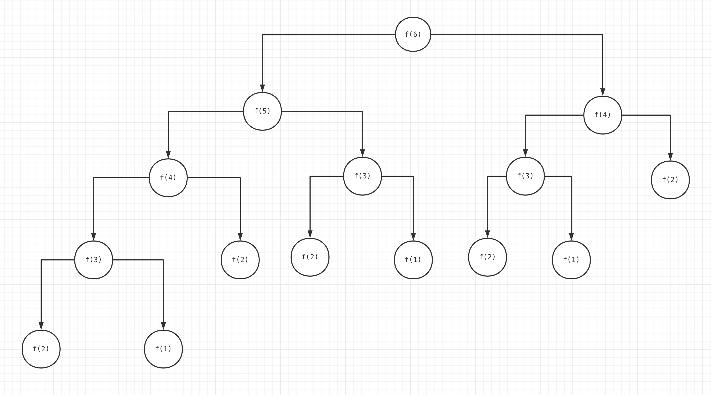

## 数据结构分类

### 一维数据结构

- 基础：数组(array)、链表(linked list)、跳表(skip list)
- 高级：栈(stack)、队列(queue)、双端队列(deque)、集合(set)、映射(map)/散列表(hash)

### 二维数据结构

- 基础：树(tree)、图(graph)
- 高级：二叉搜索树(binary search tree)(红黑树、AVL树)、堆(heap)、并查集(disjoint set)、字典树(trie)
(特点)

### 特殊数据结构

- 位运算(bitwise)、布隆过滤器(BloomFilter)
- LRU Cache


## 算法

- if-else, switch --> branch
- for, while loop --> iteration
- 递归 Recursion (Divide & Conquer, Backtrace)

> 所有的高级算法，最终都会归为if-else/for/递归这样的结构(不包括人工智能相关算法)，
> 所以算法的最终目的就是**找 最近 重复子问题** (非常重要)

基于以上三点，下面这些高级算法：
- 递归
- 分治
- 回溯
- 搜索(Search)：深度优先搜索(Depth first search)、广度优先搜索(Breadth first search)、启发式搜索(A*)
- 贪心(Greedy)
- 二分查找(Binary Search)
- 动态规划(Dynamic Programming)
- 排序(Sorting)
- 字符串匹配
- 哈希
- 数学(Math)、几何(Geometry)

> 在头脑中回忆上面每种算法的思想和代码模板


## 切题四件套

- Clarification
- Possible solutions
  - compare (time/space)
  - optimal
- Coding
- Test cases

## 五遍刷题法

### 第一遍
- 5分钟(最多15分钟)：读题 + 思考
- 如果没有思路/做不出来：直接看解法 (注意：看多个解法，比较解法优劣)
- 背诵、默写这些好的解法

### 第二遍
- 马上自己写(不要看别人的解法，闭卷考试🐶) --> LeetCode 提交通过
- 多种解法比较、体会 --> 优化

### 第三遍
- 过了一天之后，再重复做题
- 不同解法的熟练程度 --> 专项练习

### 第四遍
- 过了一周之后，反复回来练习相同题目
- 不熟悉的题目进行专项练习

### 第五遍
- 面试前一周恢复性训练，把之前做过的题再做一遍


## 作业
- 绘制自己的知识脑图

---

## 时间复杂度

### Big O notation
(多项式量级)
- O(1): 常数阶
- O(log n): 对数阶
- O(n): 线性阶
- O(n * log n): 线性对数阶
- O(n^2): 平方阶
- O(n^3): 立方阶
- O(n^k): k次方阶

(非多项式量级，这种算法问题被称为NP问题)
- O(2^n): 指数阶
- O(n!): 阶乘阶

## 空间复杂度
> (一般就是数组的长度或者递归的深度)

- O(1): 常数阶
- O(n): 线性阶
- O(n^2): 平方阶
像`O(log n)`、`O(n * log n)`这样的对数阶复杂度平时都用不到。


## 递归函数的时间复杂度分析
把递归的执行顺序画出一个树形结构，我们称之为它的递归状态的递归树，或者就是状态树。

比如，斐波那契数列
Fib: 0, 1, 1, 2, 3, 5, 8, 13, 21, ...
F(n) = F(n-1) + F(n-2)


```js
int fib(int n) {
    if (n < 2) return n;
    return fib(n-1) + fib(n-2);
}
```


(时间复杂度为k^n)

> 分析时间复杂度: <br/>
> 假设n=6,求 fib(6): <br/>
fib(6) = fib(5) + fib(4) = (fib(4) + fib(3)) + (fib(3) + fib(2)) <br/>
每展开一层，计算步骤就变为2倍，因此是指数级增长, O(2^n) <br/>
如果采用记忆化递归，则复杂度降为 O(n)

> 递归问题一般有2种优化思路：
> 1. 记忆化递归：通过增加缓存来减少重复计算
> 2. 动态规划，将递归问题转为循环问题
