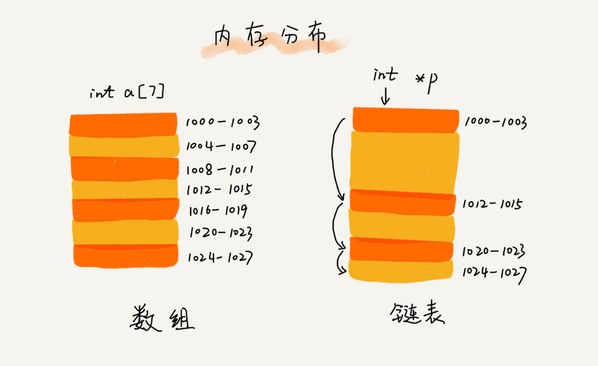

## 数组

### 定义
数组(Array)是一种**线性表**数据结构。它用一组**连续的内存空间**，来存储一组具有**相同类型的数据**。

### 特性
- 支持随机访问元素，时间复杂度为 O(1) (连续内存空间和相同数据类型的基础上，通过计算偏移地址实现该特性)
- 插入/删除元素效率较低，时间复杂度为 O(n) (需要通过移动后续元素来保证内存的连续性)
- 特殊场景下的插入操作可以实现时间复杂度为 O(1)，即不需要考虑后续元素的顺序

> 数组元素的内存地址计算公式： 
> 一维：a[k]_address = base_address + k * type_size 
> 二维(m*n)：a[i, j]_address = base_address + (i * n + j) * type_size

## 链表

### 内存分布(与数组比较)

### 概念
头结点
尾结点
后继指针next
前驱指针prev

### 1. 单链表

#### 特性
- 支持插入、删除操作，<del>时间复杂度为 O(1) (因为并不需要为了内存连续而移动元素)</del>
- 插入
  - 作为后继节点插入，时间复杂度为 O(1)
  - 作为前驱节点插入，时间复杂度为 O(n) (因为要先找到插入之前的前驱节点，就需要从头节点开始遍历)
- 删除
  - 删除给定值的节点，时间复杂度为 O(n) (需要从头结点开始遍历，分别找到目标节点及其前驱节点)
  - 删除给定地址的节点，时间复杂度也为 O(n) (需要从头结点开始遍历，找到目标节点的前驱节点)
- 随机访问元素效率较低，时间复杂度为 O(n) (因为需要通过节点之间的指针进行遍历)

### 2. 循环链表
> 是一种特殊的单链表

#### 优点
从链尾可以访问链头，特别适合处理环形结构的数据，比如[约瑟夫问题](https://zh.wikipedia.org/wiki/%E7%BA%A6%E7%91%9F%E5%A4%AB%E6%96%AF%E9%97%AE%E9%A2%98)

### 3. 双向链表

#### 优缺点
- 缺点：需要 2 个额外空间来存储指针，比单链表占用更多空间
- 优点：支持双向遍历

#### 特性
- 插入
  - 作为后继节点插入，时间复杂度为 O(1)
  - 作为前驱节点插入，时间复杂度也为 O(1)
- 删除
  - 删除给定值的节点，和单链表一样，时间复杂度为 O(n) (需要从头结点开始遍历，找到目标节点)
  - 删除给定地址的节点，时间复杂度为 O(1) (不需要遍历)

#### 算法思想
空间换时间

### 4. 双向循环链表

### 链表 VS 数组性能对比

在项目中选择数据结构时，并不是完全根据复杂度来决定的，还要综合考虑其他因素。

数组简单易用，内存连续，可以借助 CPU 的缓存机制，预读数据，高效访问数据；
链表内存不连续，对 CPU 缓存不友好，无法使用预读机制。

数组大小固定，一经声明就占用整块连续内存空间，动态扩容需要拷贝数据，分配较大空间时可能出现内存不足而分配失败；
链表本身没有大小限制，天然支持动态扩容。

如果对内存利用率非常苛刻，不建议使用链表，因为链表的每个节点都需要额外消耗存储空间来存储指针，会导致内存消耗翻倍，
而且对链表进行频繁的插入、删除操作，还会导致频繁的内存申请和释放，容易造成内存碎片，有可能导致频繁的 GC。

### 数组和链表的时间复杂度对比

1. 链表

| 操作 | 时间复杂度(链表) | 时间复杂度(数组) |
| --- | :--- | :--- |
| prepend | O(1) | O(n) 特殊情况下，可以优化成 O(1)| 
| append | O(1) | O(1) |
| lookup | O(n) | O(1) |
| insert | O(1) ? (不是O(n)吗)| O(n) |
| delete | O(1) ? (不是O(n)吗)| O(n) |

## 跳表(Skip List)

> 只能用于元素有序的情况

跳表(Skip List)对标的是平衡树(AVL Tree)和二分查找，是一种 插入/删除/查找 都是 O(log n) 的数据结构。1989年出现。
它最大的优势是原理简单、容易实现、方便扩展、效率更高。因此在一些热门的项目里用来替代平衡树，如 Redis、LevelDB 等。
