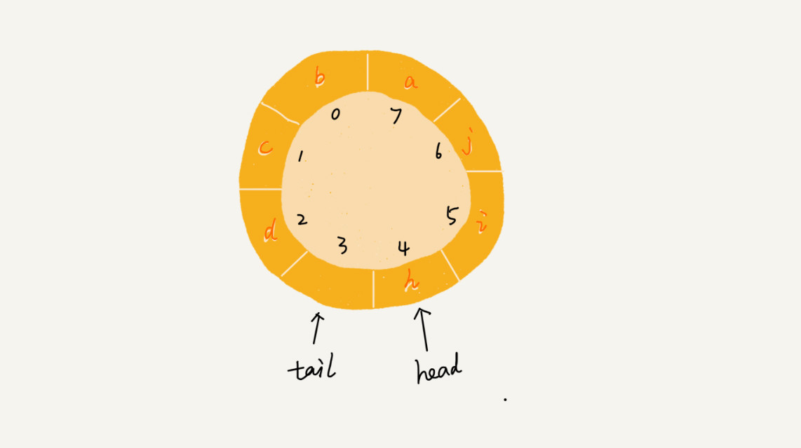

## 数组(Array)

### 定义
数组(Array)是一种**线性表**数据结构。它用一组**连续的内存空间**，来存储一组具有**相同类型的数据**。

### 特性
- 支持随机访问元素，时间复杂度为 O(1) (连续内存空间和相同数据类型的基础上，通过计算偏移地址实现该特性)
- 插入/删除元素效率较低，时间复杂度为 O(n) (需要通过移动后续元素来保证内存的连续性)
- 特殊场景下的插入操作可以实现时间复杂度为 O(1)，即不需要考虑后续元素的顺序

> 数组元素的内存地址计算公式： 
> 一维：a[k]_address = base_address + k * type_size 
> 二维(m*n)：a[i, j]_address = base_address + (i * n + j) * type_size

## 链表(Linked List)

### 内存分布(与数组比较)

### 概念
头结点
尾结点
后继指针next
前驱指针prev

### 1. 单链表

#### 特性
- 支持插入、删除操作，<del>时间复杂度为 O(1) (因为并不需要为了内存连续而移动元素)</del>
- 插入
  - 作为后继节点插入，时间复杂度为 O(1)
  - 作为前驱节点插入，时间复杂度为 O(n) (因为要先找到插入之前的前驱节点，就需要从头节点开始遍历)
  - 如果只考虑插入操作本身，不考虑查找过程，则时间复杂度为 O(1)
- 删除
  - 删除给定值的节点，时间复杂度为 O(n) (需要从头结点开始遍历，分别找到目标节点及其前驱节点)
  - 删除给定地址的节点，时间复杂度也为 O(n) (需要从头结点开始遍历，找到目标节点的前驱节点)
  - 如果只考虑删除操作本身，不考虑查找过程，则时间复杂度为 O(1)
- 随机访问元素效率较低，时间复杂度为 O(n) (因为需要通过节点之间的指针进行遍历)

### 2. 循环链表
> 是一种特殊的单链表

#### 优点
从链尾可以访问链头，特别适合处理环形结构的数据，比如[约瑟夫问题](https://zh.wikipedia.org/wiki/%E7%BA%A6%E7%91%9F%E5%A4%AB%E6%96%AF%E9%97%AE%E9%A2%98)

### 3. 双向链表

#### 优缺点
- 缺点：需要 2 个额外空间来存储指针，比单链表占用更多空间
- 优点：支持双向遍历

#### 特性
- 插入
  - 作为后继节点插入，时间复杂度为 O(1)
  - 作为前驱节点插入，时间复杂度也为 O(1)
- 删除
  - 删除给定值的节点，和单链表一样，时间复杂度为 O(n) (需要从头结点开始遍历，找到目标节点)
  - 删除给定地址的节点，时间复杂度为 O(1) (不需要遍历)
  - 如果只考虑删除操作本身，不考虑查找过程，则时间复杂度为 O(1)

#### 算法思想
1. 空间换时间
2. 升维

### 4. 双向循环链表

### 链表 VS 数组性能对比

在项目中选择数据结构时，并不是完全根据复杂度来决定的，还要综合考虑其他因素。

数组简单易用，内存连续，可以借助 CPU 的缓存机制，预读数据，高效访问数据；
链表内存不连续，对 CPU 缓存不友好，无法使用预读机制。

数组大小固定，一经声明就占用整块连续内存空间，动态扩容需要拷贝数据，分配较大空间时可能出现内存不足而分配失败；
链表本身没有大小限制，天然支持动态扩容。

如果对内存利用率非常苛刻，不建议使用链表，因为链表的每个节点都需要额外消耗存储空间来存储指针，会导致内存消耗翻倍，
而且对链表进行频繁的插入、删除操作，还会导致频繁的内存申请和释放，容易造成内存碎片，有可能导致频繁的 GC。

### 写链表代码时要注意的边界条件
1. 如果链表为空，代码是否正确？
2. 如果链表只包含一个节点时，代码是否正确？
3. 如果链表只包含两个节点时，代码是否正确？
4. 代码逻辑在处理头结点和尾结点时，是否正常工作？

### 链表的常见操作
1. 单链表反转
2. 链表中环的检测
3. 两个有序链表的合并
4. 删除链表倒数第 n 个节点
5. 求链表的中间节点

## 跳表(Skip List)

> 只能用于元素有序的情况

跳表(Skip List)是一种动态数据结构，对标的是平衡树(AVL Tree)和二分查找，是一种 插入/删除/查找 都是 O(log n) 的数据结构。1989年出现。

是典型的用空间换时间的算法思想，通过构建多级索引来提高查询效率，实现了基于链表的“二分查找”，空间复杂度为 O(n)。
跳表的实现非常灵活，可以通过改变索引的构建策略，有效平衡执行效率和内存消耗。

它最大的优势是原理简单、容易实现、方便扩展、效率更高。因此在一些热门的项目里用来替代平衡树，如 Redis、LevelDB 等。

### 数组、链表和跳表的时间复杂度对比

| 操作 | 时间复杂度(数组) | 时间复杂度(链表) | 时间复杂度(跳表) |
| --- | :--- | :--- | --- |
| prepend | O(n) 特殊情况下，可以优化成 O(1) | O(1) | O(1) | 
| append | O(1) | O(1) | O(1) |
| lookup | O(1) | O(n) | O(log n) |
| insert | O(n) | O(1) | O(log n) |
| delete | O(n) | O(1) | O(log n) |

---

## 栈(Stack)

### 特性
- 后进先出、先进后出
- 操作受限的线性表，只允许在一端插入和删除数据，两个基本操作：入栈(push)和出栈(pop)
- 入栈和出栈的时间复杂度为 O(1)
- 空间复杂度为 O(1)

### 实现方式
- 数组：顺序栈
    - 查询的时间复杂度为 O(1)
- 链表：链式栈
    - 查询的时间复杂度为 O(n)

### 常见应用场景
- 函数调用栈
- 表达式求值(编译器)
  - 操作数栈
  - 运算符栈
- 括号匹配
- 浏览器的浏览记录 (采用2个栈实现)
- 递减栈

## 队列(Queue)

### 特性
- 先进先出
- 操作受限的线性表，两个基本操作：入队(enqueue)和出队(dequeue)
- 入队和出队的时间复杂度为 O(1)

### 实现方式
- 数组：顺序队列，当 tail=n 时，入队操作会导致数据搬移，但根据摊还分析，时间复杂度仍然为 O(1)。队列大小有限
  - 队满的判定条件：tail = n
  - 队空的判定条件：head = tail
- 链表：链式队列，不涉及数据搬移，支持无限排队的无界队列(unbounded queue)，但这种队列可能会导致排队时间过长

### 循环队列

> 实现重点是确定队空和队满的判定条件

优点是不需要搬移数据，但是会浪费一个存储空间

由于队空和队满的判定条件都是 head=tail，无法区分，所以我们在队满的状态下少存一个元素，这样就可以通过(tail+1)=head来判定队满了。

- 队空的判定条件：head = tail
- 队满的判定条件：(tail+1)%n = head

### 阻塞队列和并发队列

阻塞队列就是在队列的基础上增加了阻塞操作。
- 队空时，出队操作会被阻塞，直到有数据才会返回。
- 队满时，入队操作会被阻塞，直到有空间才会返回。

阻塞队列可以用来实现**生产者-消费者模型**

当有多个线程同时操作一个队列时，需要保持线程安全，这种队列就叫做**并发队列**
最简单直接的实现并发安全的方式就是在入队和出队操作上加锁，但这样的锁粒度太大，会导致并发度比较低。
可以基于数组实现的循环队列上使用 CAS 原子操作，实现高效的并发队列。

### 双端队列(Deque)

可以在两端进行`push`和`pop`操作，相当于`stack`和`queue`的组合体。

- 插入和删除都是 O(1)
- 查询时 O(n)

## 优先队列(Priority Queue)
> 不再是先进先出，而是按照优先级排序

### 特性
- 插入操作: O(1)
- 取出操作: O(log n) - 按照元素的优先级取出
- 底层具体实现的数据结构较为多样和复杂: heap、bst、treap

> 课程安排： 
> https://www.processon.com/view/link/5ee5a6406376891e81c9e459  
> 本周完成度: 80%
